# Правила маппинга
### Большинство из пунктов важны но так же бывают и исключения
## Маппинг шаттлов

1. <u>Убедитесь, что на вашем судне установлены скрубберы которые выводят газы в космос (все генераторы выбрасывают CO2).</u>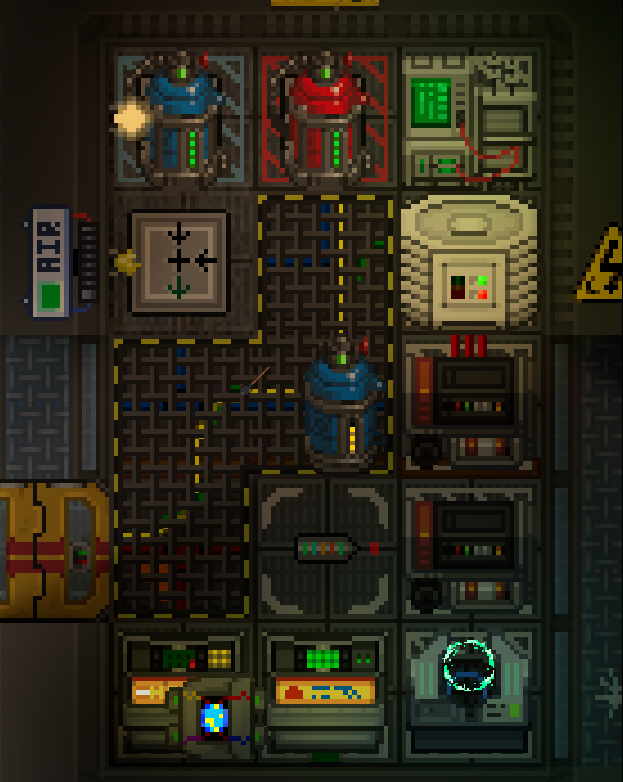
2. <u>Раскрасьте кислородные/скруббер трубы в их цвета.</u>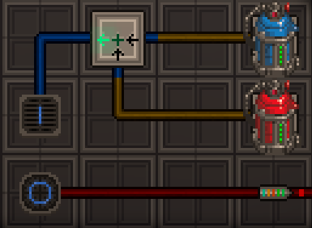
3. <u>На шаттле должно быть:</u>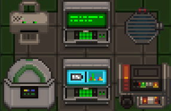
    1. Факс.  
    2. Консоль станционного учёта. (если на шаттле есть должности)  
    3. Варп точка.  
    4. “Спавн позднее присоединение”.  
    5. Голопад.
    7. Гироскоп.  
    8. Мини генератор гравитации.
    10. Генераторы (используйте для шаттлов) и один шкаф с топливом  
    11. СМЭС, подстанции и ЛКП.
4. <u>Используйте двухступенчатые шлюзы (например, стыковочный шлюз \+ красные шлюзы).</u>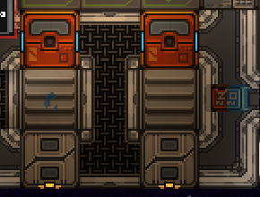
5. <u>Разместите направленные вентиляторы на шлюзы которые выходят в космос.</u>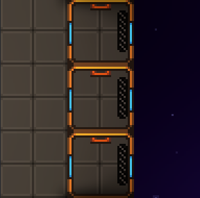
7. <u>Двигатели должны быть доступны (в случае ЭМИ атак или модернизации).</u>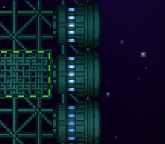
8. <u>Ваша проводка должна быть логичной и минимальной.</u>
9. <u>На шаттле <strong>не</strong> должно быть индивидуально заполненных шкафчиков (используйте уже имеющиеся)</u>
10. Выполните команды <u><code>variantize</code></u> и <u><code>fixgridatmos</code></u> на гриде шаттла
11. <u>На шаттле <strong>не</strong> должны быть POI вендоматы или машины.</u>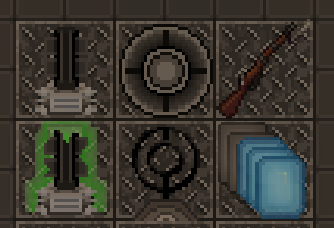
12. <u>Сохраните свой шаттл как грид, а не как карту.</u>
13. <u>Шаттл должен быть не меньше 20 тайлов или не больше 2304 и так же не должен выходить по размерам из своей категории<</u>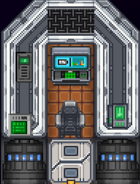
15. <u>Единственное, что можно установит на окнах, это неоновые вывески, ставни и гермозатвор.</u>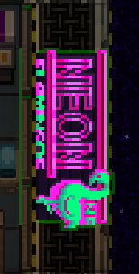
16. <u>Не переименовывайте варп поинты, игра сама даёт им имя.</u>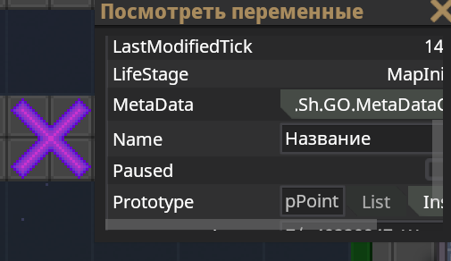
17. <u>Не пишите имя каких то персонажей в заметках на корабле.</u>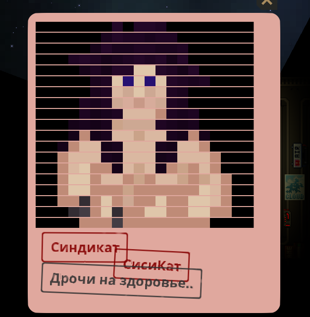
18. <u>Экспедиционные корабли должны использовать ДАМ и должны иметь минимальную цену в 50 000 кредитов.</u>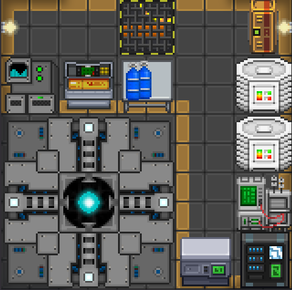
19. <u>Шаттл <strong>НЕ</strong> должен использовать закрытые шлюзы, все шлюзы на шаттлах должны быть <strong>БЕЗ</strong> доступов</u>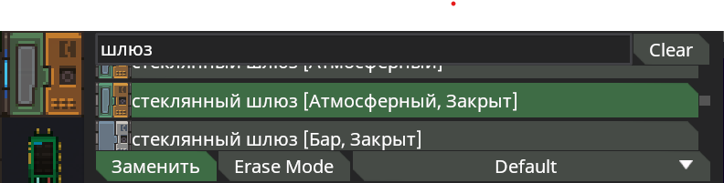
20. <u>На шаттле должно быть аварийное снаряжение:</u>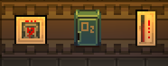
    1. Дефибриллятор.
    2. Огнетушитель.
    3. Шкаф со скафандром (можно и аварийный).
21. <u>На шаттле **не** должно быть:</u>
    1. Газодобытчики.  
    2. РИТЭГи (сломанные или исправные).  
    3. Любые источники энергии, не потребляющие топливо (за исключением солнечных панелей).
    5. Любое огнестрельное оружие.  
    6. Избыточные материалы (слишком много стали или стекла).

---

* <u>Не размещайте перпендикулярно стены или окна</u>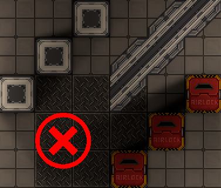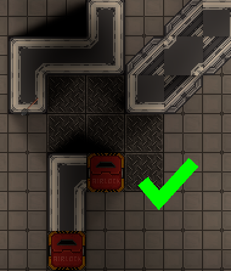
  * Особое внимание следует уделить планировке помещений на корабле, а также стенам и диагональным объектам. Например, крайне не рекомендуется размещать двери на перпендикулярных стенах прямо в углах. В некоторых небольших и компактных проектах это необходимо, но по возможности следует избегать этого.
  * Диагональные или наклонные окна и стены также требуют особого внимания. У них нету компонента теней, что позволяет смотреть сквозь них, и использование диагональных стен или окон без стен запрещено.

* <u>Не забывайте про пожарные и воздушние сигнализации.</u>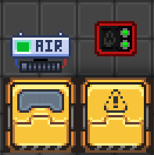
  * Старайтесь размещать на шаттлах пожарный шлюзы, пожарные сигнализации, воздушные сигнализации, сенсоры воздуха и не забудьте их подключить.  

* <u>Ваш шаттл должен быть задекорирован.</u>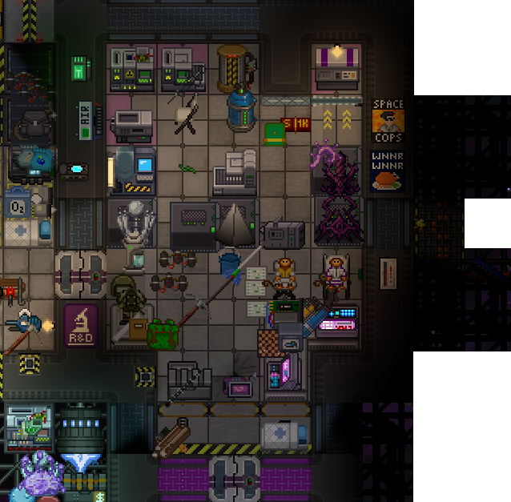
  * Не забывайте про декали, плакаты и другие способы декораций шаттлов.

* <u>Для некоторых шаттлов нужен быстрый доступ в космос.</u>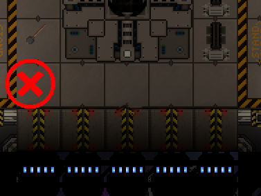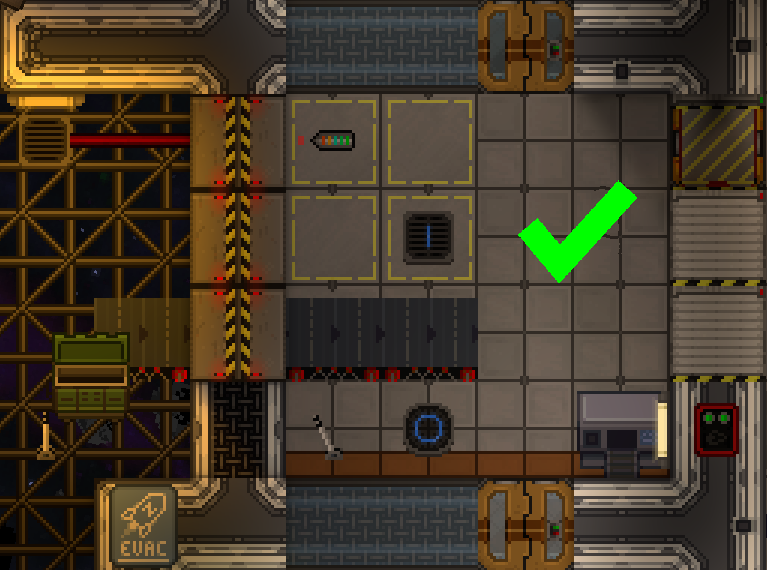
  * Для таких шаттлов как утилизатоские, медицинские и инженерные нужен быстрый доступ в космос вы можете использовать направленные вентиляторы и гермозатворы чтобы оказать быстрый доступ в космос.

* <u>Окна.</u>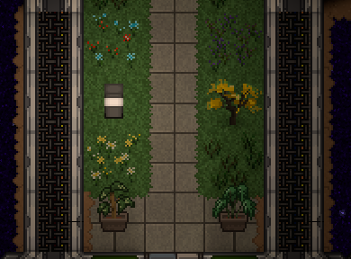
  * Окна не должны быть слишком большими (не больше 4 тайлов)
  * Кроме того, под всеми окнами должны быть установлены решетки для обеспечения единообразия стиля.
  * Также не используйте тайловые решетки под окнами

* <u>Компоненты.</u>
  * На гриде вашего шаттла должен быть добавлен компонент BecomesStation.
  * В самом компоненте укажите id вашего шаттла.

* <u>Устройства антагонистов</u>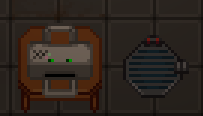
  * Если ваш шаттл сделан для антагонистов то используйте специальный голопад NFHolopadShipAntag и факс FaxMachineShipAntag антагонистов.
  * Данное правило не относится к синдикатовской консоли опознания, её ставить запрещено.

* <u>Наименование гридов</u>
  * Не используйте имя grid для шаттла, старайтесь всегда переименовывать грид в имя вашего шаттла чтобы не было проблем при ручном спавне.