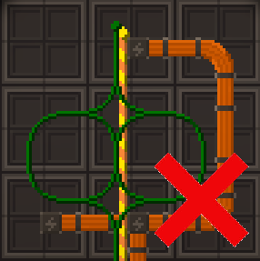
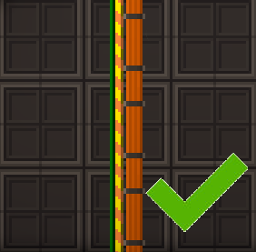
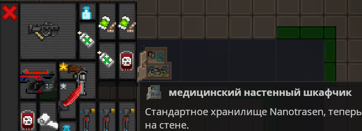
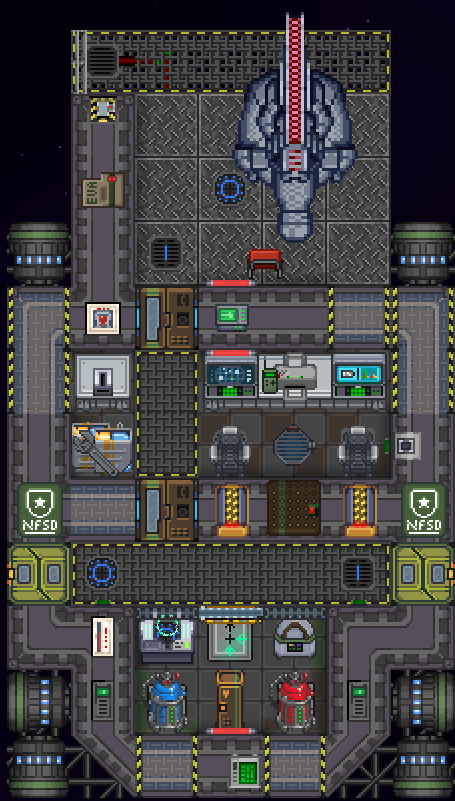
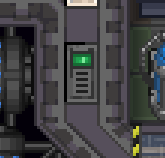
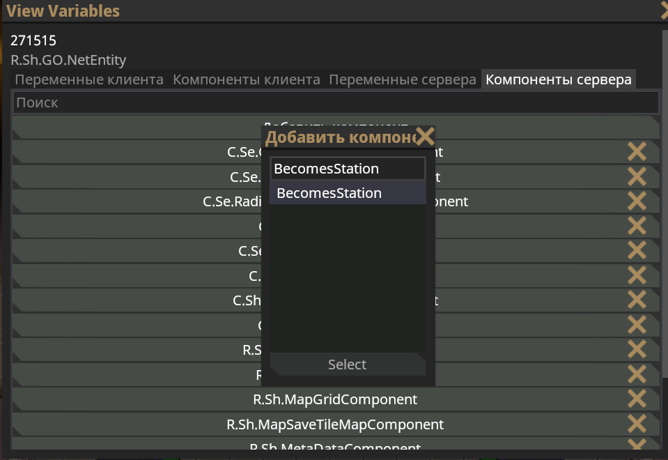

# Правила маппинга
### Большинство из пунктов важны но так же бывают и исключения

Уточнение по шаттлам которые были сделаны до обновления правил и одобреные. 
Они могут игнорировать новые пункты правил если нету грубейших нарушений. 

## Маппинг шаттлов

1. Убедитесь, что на вашем судне установлены скрубберы которые выводят газы в космос (все генераторы выбрасывают CO2).
2. Раскрасьте кислородные/скруббер трубы в их цвета.
3. На шаттле должно быть:
    1. Факс.  
    2. Консоль станционного учёта. (если на шаттле есть должности)  
    3. Варп точка.  
    4. “Спавн позднее присоединение”.  
    5. Голопад.
    7. Гироскоп.  
    8. Мини генератор гравитации.
    10. Генераторы (используйте для шаттлов) и один шкаф с топливом  
    11. СМЭС, подстанции и ЛКП.
4. Используйте двухступенчатые шлюзы (например, стыковочный шлюз \+ красные шлюзы).
5. Разместите направленные вентиляторы на шлюзы которые выходят в космос.
7. Двигатели должны быть доступны (в случае ЭМИ атак или модернизации).
8. Ваша проводка должна быть логичной и минимальной.
9. На шаттле <strong>не</strong> должно быть индивидуально заполненных шкафчиков (используйте уже имеющиеся)
10. Выполните команды <code>variantize</code> и <code>fixgridatmos</code> на гриде шаттла
11. На шаттле <strong>не</strong> должны быть POI вендоматы или машины.
12. Сохраните свой шаттл как грид, а не как карту.
13. Шаттл должен быть не меньше 20 тайлов или не больше 2304 и так же не должен выходить по размерам из своей категории
14. Единственное, что можно установит на окнах, это неоновые вывески, ставни и гермозатвор.
15. Не переименовывайте варп поинты, игра сама даёт им имя.
16. Не пишите имя каких то персонажей в заметках на корабле.
17. Экспедиционные корабли должны использовать ДАМ и должны иметь минимальную цену в 50 000 кредитов.
18. Шаттл <strong>НЕ</strong> должен использовать закрытые шлюзы, все шлюзы на шаттлах должны быть <strong>БЕЗ</strong> доступов
19. На шаттле должно быть аварийное снаряжение:
    1. Дефибриллятор.
    2. Огнетушитель.
    3. Шкаф со скафандром (можно и аварийный).
20. На шаттле **не** должно быть:
    1. Газодобытчики.  
    2. РИТЭГи (сломанные или исправные).  
    3. Любые источники энергии, не потребляющие топливо (за исключением солнечных панелей).
    4. Любое огнестрельное оружие.
    5. Избыточные материалы (слишком много стали или стекла).

---

* Не размещайте перпендикулярно стены или окна
  * Особое внимание следует уделить планировке помещений на корабле, а также стенам и диагональным объектам. Например, крайне не рекомендуется размещать двери на перпендикулярных стенах прямо в углах. В некоторых небольших и компактных проектах это необходимо, но по возможности следует избегать этого.
  * Диагональные или наклонные окна и стены также требуют особого внимания. У них нету компонента теней, что позволяет смотреть сквозь них, и использование диагональных стен или окон без стен запрещено.

* Не забывайте про пожарные и воздушние сигнализации.
  * Старайтесь размещать на шаттлах пожарный шлюзы, пожарные сигнализации, воздушные сигнализации, сенсоры воздуха и не забудьте их подключить.

* Орудия шаттлов
  * Разрешено использование **ТОЛЬКО** ванильных орудий для шаттлов в этот перечень входит EXP-2100g "Дастер", EXP-320g "Дружба", LSE-1200c "Перфоратор", LSE-400c "Пулемёт Свалинн", пушка пиратского шаттла
  * Учтите что EXP-2100g "Дастер" и EXP-320g "Дружба" Должны содержать только **НЕЛЕТАЛЬНЫЕ** боеприпасы
  * Так же орудия разрешены **ТОЛЬКО** для шаттлов верфи Пиратов, Синдикат и ДШ  

* Вспомогательная силовая установка (ВСУ)
  * ВСУ разрешён **ТОЛЬКО** Для шаттлов верфи ДШ и Синдикат и только если шаттл размером микро

* Ваш шаттл должен быть задекорирован.
  * Не забывайте про декали, плакаты и другие способы декораций шаттлов.

* Для некоторых шаттлов нужен быстрый доступ в космос.
  * Для таких шаттлов как утилизатоские, медицинские и инженерные нужен быстрый доступ в космос вы можете использовать направленные вентиляторы и гермозатворы чтобы оказать быстрый доступ в космос.

* Окна.
  * Окна не должны быть слишком большими (не больше 4 тайлов)
  * Кроме того, под всеми окнами должны быть установлены решетки для обеспечения единообразия стиля.
  * Также не используйте тайловые решетки под окнами

* Компоненты.
  * На гриде вашего шаттла должен быть добавлен компонент BecomesStation.
  * В самом компоненте укажите id вашего шаттла.

* Устройства антагонистов
  * Если ваш шаттл сделан для антагонистов то используйте специальный голопад NFHolopadShipAntag и факс FaxMachineShipAntag антагонистов.
  * Данное правило не относится к синдикатовской консоли опознания, её ставить запрещено.

* Наименование гридов
  * Не используйте имя grid для шаттла, старайтесь всегда переименовывать грид в имя вашего шаттла чтобы не было проблем при ручном спавне.