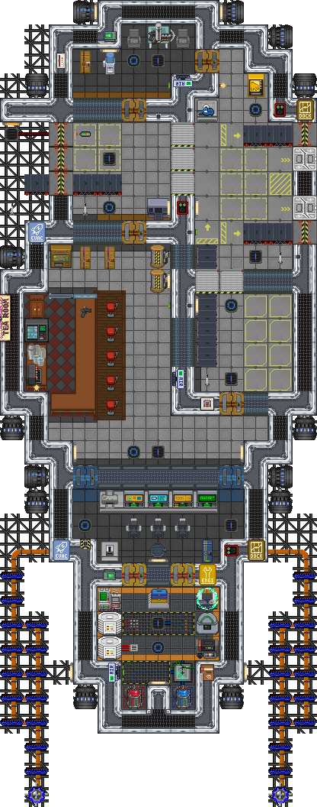

# Типы и тиры
### Тут описаны все **<u>типы</u>** шаттлов и что на них может быть для понимания

    <table style="width:100%; border-collapse: collapse;">
      <thead>
      <tr>
        <th>Утилизаторский</th>
        <th>Медицинский</th>
        <th>Научный</th>
      </tr>
      <tr>
        <th>Пользуется спросом у новичков</th>
        <th>Должны быть вещи для реанимации пациентов</th>
        <th>Камера для иследования артефактов</th>
      </tr>
      </thead>
      <tbody>
      <tr>
        <td>
          1. Переработчик руды 
          2. Переработчик лома 
          3. Утилизационный ТехФаб 
          4. Переработчик материалов 
          5. Гермозатворы 
          6. Утиль Инструменты
        </td>
        <td>
          1. Больничная койка 
          2. Медицинский ТехФаб 
          3. Криокапсула 
          4. Раздатчик химикатов 
          5. Химоборудование 
          6. Наномед
        </td>
        <td>
          1. РНД сервер 
          2. Анализатор артефактов 
          3. Протолат 
          4. Принтер схем 
          5. Фабрикатор экзокостюмов 
          6. Инстр. для изучение аном
        </td>
      </tr>
    </tbody>
  </table>

    <table style="width:100%; border-collapse: collapse;">
      <thead>
      <tr>
        <th>Карго</th>
        <th>Сервис/РП</th>
        <th>Инженерный</th>
      </tr>
      <tr>
        <th>Тип грузовых шаттлов во многом зависит от конструкции и размеров</th>
        <th>Множество тематических шаттлов, которые не привязаны к механикам</th>
        <th>Фронтир часто обновляет инженерный контент, механики могут менятся</th>
      </tr>
      </thead>
      <tbody>
      <tr>
        <td>
          1. Конвейерные ленты 
          2. Большой док с конвейерами 
          3. Много пространства для груза
        </td>
        <td>
          1. Кухня 
          2. Гидропоника 
          3. Раздатчики напитков 
          4. Сервисный ТехФаб 
          5. Услуги уборки, библиотека, развлечения
        </td>
        <td>
          1. Бур для добычи газа 
          2. Инженерный ТехФаб 
          3. Принтер схем 
          4. Упаковщик 
          5. Внешний газовый шлюз 
          6. Переносной газовый шлюз
        </td>
      </tr>
    </tbody>
  </table>

    <table style="width:100%; border-collapse: collapse;">
      <thead>
      <tr>
        <th>Экспедиционный</th>
        <th>НФСД</th>
        <th>Чёрный рынок</th>
      </tr>
      <tr>
        <th>Экспедиционный тип всегда полный, не половинчатый</th>
        <th>Требует сильной балансировки в ПВП</th>
        <th>Требует сильной балансировки в ПВП</th>
      </tr>
      </thead>
      <tbody>
      <tr>
        <td>
          1. ДАМ 
          2. Консоль утилизаторских экспедиций 
          3. Телекоммуникационный сервер
        </td>
        <td>
          1. Корабельное оружие 
          2. Консоль системы опознавания 
          3. Консоли трафика
        </td>
        <td>
          1. Корабельное оружие 
          2. Консоль системы опознавания 
          3. Консоли трафика
        </td>
      </tr>
    </tbody>
  </table>

### Тут написаны все **<u>тиры</u>** для обозначения наценок на шаттлы

<table style="width:100%; border-collapse: collapse;">
<thead>
<tr>
<th>1 ТИР</th>
<th>2 ТИР</th>
<th>3 ТИР</th>
</tr>
</thead>
<tbody>
<tr>
<td>Имеет только один тип шаттла</td>
<td>Может иметь 1 тип шаттла с половиной</td>
<td>Может иметь 2 типа шаттла с половиной</td>
</tr>
<tr>
<td>Другие машины из других типов не допускаются</td>
<td>Разрешены обычные жилые/бытовые зоны</td>
<td>Разрешены полные дормы/бытовые зоны</td>
</tr>
<tr>
<td>Минимальные жилые зоны</td>
<td>Огнетушители и воздушные сигнализации</td>
<td>Может иметь встроенное ИИ корабля</td>
</tr>
<tr>
<td>Наценка: 5–10%</td>
<td>Наценка: 15–30%</td>
<td>Наценка: 30–50%</td>
</tr>
</tbody>
</table>

### Пример: Баржа

<table style="width:100%; border-collapse: collapse;">
<tbody>
<tr>
<td style="width:50%; vertical-align: middle;">Баржа полностью соответствует двум типам. Большой карго со встроенными конвейерами и пластиковыми створками для удобства использования делает её идеальным грузовым судном и относит к типу "Карго".  
Она также оснащена гермозатворами, переработчиком руды и инструментами для утилизации/добычи астероидов. Это позволяет ей соответствовать типу "Утилизаторский" и эффективно выполнять соответствующие задачи.  
Кроме того, благодаря раздатчику алкоголя, АлкоМату и мини-бару, корабль частично выполняет функцию "Сервиса" для экипажа. Хотя он не может полностью удовлетворить потребности команды в еде и напитках, он частично закрывает эту роль, занимая дополнительный слот типа "Сервис".  
Это помещает баржу в третий тир, с ожидаемой ценой в районе 30–50%. При этом необходимо учитывать несколько факторов: заполненность каждого типа, наличие особых элементов (таких как встроенный ИИ или ценные объекты). Всё это способствует тому, что реальная  наценка корабля ближе к 30%, делая его одним из самых дешевых кораблей третьего тира.
</td>
<td style="width:50%; vertical-align: middle; text-align: center;">
  
</td>
</tr>
</tbody>
</table>

